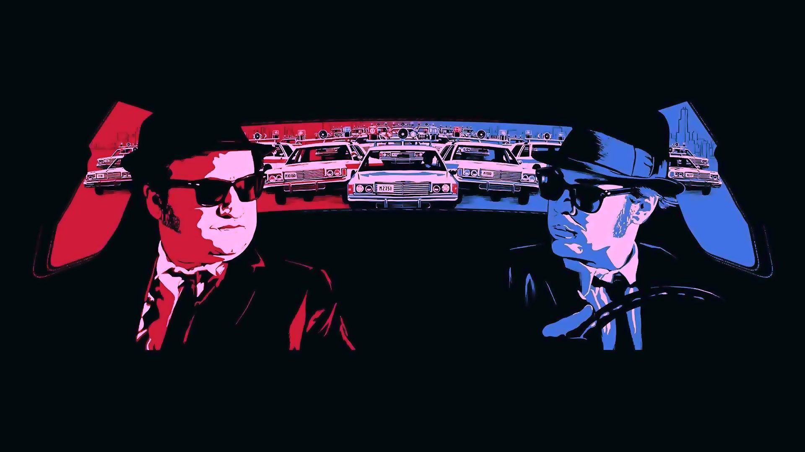
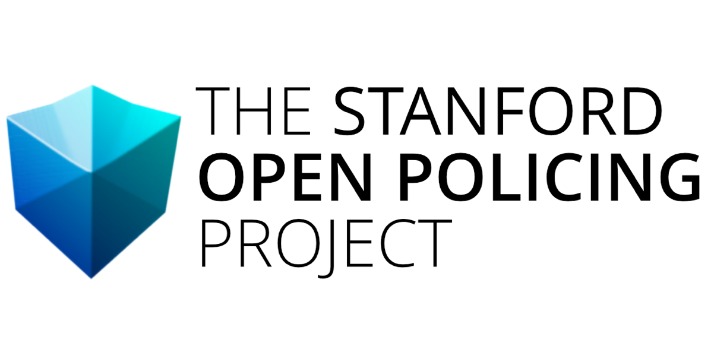

# Data Visualization project (COM-480 EPFL)
## Bias in police stops

## Motivation

More than 20 million Americans are stopped for traffic violations each year, making it one of the most common ways for the public to interface with the police.
However, there has never been a comprehensive national repository containing information on these interactions. To alter that, the Open Policing Stanford dataset collaborated with Big Local News to collect a dataset of over 200 million traffic stops done in dozens of cities and states throughout the US, making it the largest such endeavor to date.

It has become a valuable resource for politicians, scholars, journalists, and campaigners striving to improve policing via data.
In our turn, we too want to help ameliorate policing and we will do so in our visualizations by raising awareness on potential racial and gender biases in police stops.

## Dataset

[Stanford Open Policing Project](https://openpolicing.stanford.edu/data/), 100 million traffic stops in the USA.

[Data Census gouv](https://data.census.gov/cedsci/table?q=California\%20ethnicity\%20by\%20county&g=0100000US&tid=DECENNIALPL2020.P2), proportion of ethnicities per county.

[US county gender](https://www.kaggle.com/datasets/headsortails/covid19-us-county-jhu-data-demographics?select=us_county.csv}{https://www.kaggle.com/datasets/us\_county.csv), proportion of genders per county.

[Data after processing](https://drive.google.com/drive/folders/1KLRz1u3J8LqiPp10Lt3V_TuCJL9h8w4c?usp=sharing), implemented by our team.

## Problematic

We want to investigate a potential variation in racial bias in police stops from 2009 to
2016. We also want to explore, in case such variations exist, if those are constant across
different states of America. 
With the visualization we implemented you will be able to visualize:

* Profiles who are most likely of getting stopped by police
* Geographical representation by county of stops in California and Texas
* Interactive evolution of bias across time
* Potential other biases like gender and age
* Explore potential interaction in the features (ethnicity, gender, age ..) for police
stops bias
* Measure Hit rate (the percent of searches that find contraband

## Team members
* Coralie Grobel, 270513
* Nicolas Delamaide, 271789
* Clément Chaffard, 274777

## Link to Website
[Our website](https://com-480-data-visualization.github.io/datavis-project-2022-control-z-zone/)

## Contribute to the project
You will find all the necessary documentation for the tools and requirements you need if you want to clone the repository and contribute to project in the folder [technical_setup](./technical_setup/README.md).

## Milestones

### Milestone 1

[Link to Milestone 1](./reports/Milestone1.pdf)

In this milestone, you will find:
* a description and links to the datasets used
* an explanation to the problematic
* an explanation to the explanatory analysis of the datasets
* some related works on the subject
* some sources that inspired us

## Milestone 2

[Link to Milestone 2](./reports/Milestone2.pdf)

In this milestone, you will find:
* the sketches of the vizualiations we want to make in our final product
* the tools that will be useful to achieve that project
* the core visualization that we expect to implement

## Milestone 3

[Link to Process Book](./reports/ProcessBook.pdf)

In the process book, you will find:
* A description of the path we took to obtain the final result
* an explanation of the challenges that we faced and design decisions that we took
* the peer assessment, including a breakdown of the parts of the project completed by each team member

### Screencast

[Link to Screencast video](./reports/Milestone3/screencast.zip)
The video showcases what one is able to do with the visualizations we implemented on our website.

